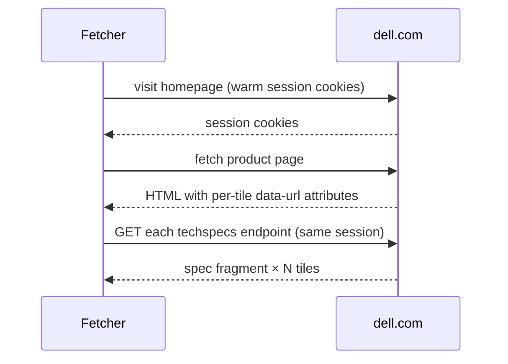
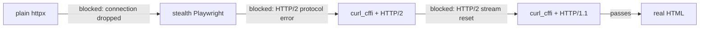

# Source Atlas — how each source is scraped

**Status:** active &nbsp;·&nbsp; **Last updated:** 2026-05-13 &nbsp;·&nbsp; **Library version:** 1.6.0

> A 2-minute map of every source the library can read — or drill into one row for the full story. For dense field-by-field shape, see [`ARCHITECTURE.md §11`](ARCHITECTURE.md#11-per-source-coverage) and [`CONSUMER_GUIDE.md §9`](CONSUMER_GUIDE.md#9-data-shape-quick-reference).

---

## 1. What the library does

scrapers-lib knows **how** to fetch from every registered source. It does not decide **what** to fetch or **why** — that's the consumer's job. Every fetcher returns one of two shapes: `RawMention` (text: reviews, posts, article bodies) or `ProductSnapshot` (structured: specs, price, stock).

## 2. Reliability tiers

Sources are grouped by **how likely they are to break**, not by subject matter.

| Tier | Access method | Expect | Sources |
|---|---|---|---|
| 1 | Official APIs & feeds | Reliable | RSS, Article, Reddit (×2), YouTube, BestBuy API |
| 2 | Manufacturer spec pages | May need parser updates after site redesigns | Dell, HP, Lenovo, ASUS, Acer, MSI |
| 3 | Retail pages behind bot gates | Partial failures are normal | BestBuy reviews, Amazon (×2) |

## 3. Method at a glance

| Source | Primitive | Dependency |
|---|---|---|
| `rss` | RSS feed parser | feedparser |
| `article` | Main-content extractor over a Chrome-impersonated session | trafilatura + curl_cffi |
| `reddit`, `reddit_comments` | Plain JSON endpoint | httpx |
| `youtube` | Caption-track API | youtube-transcript-api |
| `bestbuy_api` | Official product API | httpx + API key |
| `dell` | Stealth browser → internal API | Playwright + playwright-stealth |
| `hp` | Chrome-impersonated fetch + warmed session → parse embedded JSON + async GraphQL | curl_cffi |
| `lenovo` | Public JSON endpoint | httpx |
| `asus` | Plain fetch → parse HTML (ROG) or Nuxt JS state (www) | httpx + py_mini_racer |
| `acer` | Plain fetch → parse SSR spec-table blocks | httpx |
| `msi` | Chrome-impersonated fetch + warmed session → parse /Specification table | curl_cffi |
| `bestbuy_reviews` | Chrome-impersonated fetch on HTTP/1.1 | curl_cffi |
| `amazon`, `amazon_reviews` | Plain fetch with Chrome UA | httpx |

## 4. Three recurring obstacles

**Anti-bot gates.** Some sites reject non-browser traffic. Three flavors hit so far, each needing a different bypass: borrow a real browser session (Dell), imitate Chrome at the network layer (BestBuy), or just send a current browser User-Agent and tolerate intermittent blocks (Amazon).

**Client-side hydration.** Some content is rendered by JavaScript after the initial HTML loads, so it never appears in a plain fetch. When we can't reach the hydrated content, we ship the reachable subset honestly and document the gap (HP's Tech Specs caveat).

**Policy shifts.** "Reliable" APIs can go dark. Reddit closed OAuth self-service in Nov 2025 → we use the unauthenticated JSON endpoints. BestBuy's Developer API fetcher ships without a credential and is dormant until one arrives.

---

# Tier 1 — APIs and feeds

These sources publish their data. We ask politely and they hand it over.

## 5.1 RSS (`rss`)

- **How:** `feedparser` against a feed URL.
- **Why this method:** RSS is a standard published format designed for parsing. No bot gates.
- **Returns:** `RawMention` — `raw_text` (title + summary), `published_at`, `author`, `channel`, `source_url`.
- **Example:** `https://feeds.ign.com/ign/games-all` → one mention per entry, e.g. `{channel: "IGN", source_title: "...", published_at: 2026-04-21}`.

## 5.2 Article body (`article`)

- **How:** `warmed_curl_session()` fetch (Chrome TLS impersonation + HTTP/1.1 + per-host homepage warming) → `trafilatura` main-content extraction. curl_cffi response errors are re-wrapped as `httpx.HTTPStatusError` so the Scheduler's retry / backoff logic is unaffected.
- **Why this method:** article HTML is cluttered with navigation, ads, and sidebars. Trafilatura strips the junk and keeps the body text that matters. Plain httpx is fine for most news / blog hosts, but Cloudflare-fronted reviewer sites (notebookcheck and similar) reject it with 403 — the same Chrome-impersonation primitive already used for HP / MSI / BestBuy clears the gate in one extra request, so since v1.4.0 the article fetcher uses it by default.
- **Returns:** `RawMention` — full body as `raw_text`, plus `source_title`, `author`, best-effort `published_at`.
- **Example:** `https://www.ign.com/articles/<slug>` → one mention with the article body. Returns empty list if no usable body (paywall, 404 chrome) — partial success is first-class.

## 5.3 Reddit (`reddit`, `reddit_comments`)

- **How:** plain httpx against Reddit's public `.json` endpoints — **not** PRAW.
- **Why this method:** Reddit closed OAuth self-service in Nov 2025, so we can't register for a developer key. The unauthenticated JSON endpoints are still open at ~60 req/min with a polite User-Agent.
- **Returns:** `RawMention` per post (`reddit`) or post + comment tree (`reddit_comments`) — body, `author`, `channel` (`r/`), `published_at`, `raw.score`, `raw.num_comments`.
- **Example:** `https://www.reddit.com/r/Games/new` → one mention per post with deep permalink in `source_url`.

## 5.4 YouTube transcripts (`youtube`)

- **How:** `youtube-transcript-api` — pulls the official caption track.
- **Why this method:** captions are published data. No Google API key needed.
- **Returns:** `RawMention` per **60-second chunk** of speech — `raw_text`, `raw.chunk_start_seconds`, and a deep-linked `source_url` (`?t=NNs`) that jumps to the chunk's start moment.
- **Example:** `https://www.youtube.com/watch?v=dQw4w9WgXcQ` → N chunks, each jumpable.
- **Gap:** no title/channel/date — those need Google's Data API, which requires credentials we don't have.

## 5.5 BestBuy Developer API (`bestbuy_api`) — dormant

- **How:** httpx against `api.bestbuy.com/v1/products/<SKU>.json` + `BESTBUY_API_KEY`.
- **Why this method:** an official API is the cleanest source when one exists.
- **Status:** **no credential available** and none expected soon. Fetcher ships but raises `RuntimeError` until a key is set. Treat BestBuy product/price data as unavailable for planning.
- **Returns:** `ProductSnapshot` — `price`, `in_stock`, `rating`, `specs` (~20–30 rows), `brand`, `model`.

---

# Tier 2 — Manufacturer spec pages

These sites don't publish data for us, but most will hand over the structured data their own product page is built from, if we know where to look. Every site is different — see [`ADDING_A_SOURCE.md`](ADDING_A_SOURCE.md) for the methodology.

## 6.1 Dell (`dell`)

- **How:** stealth Playwright session → harvest per-tile `data-url` attributes → call Dell's internal `csbapi/unifiedpd/techspecs` endpoint through the **same** browser context.
- **Why this method:** Dell's own product page triggers a hidden API call when you view Tech Specs. That API is bot-protected, but the same browser session that loaded the shop page already has the cookies it needs. We borrow the session rather than fight the gate.

- **Returns:** `ProductSnapshot` per pre-built tile — ~20 categories (processor, GPU, memory, storage, display, ports, slots, dimensions, weight, keyboard, camera, audio, chassis, wireless) plus `price`, `image_url`.
- **Example:** `https://www.dell.com/us-en/shop/dell-laptops/alienware-16` → 3 snapshots (one per "Recommended Configuration" tile).
- **`include_options=True` (v1.5.0):** opt-in kwarg that additionally navigates to the `cty/pdp` configurator URL (constructed internally from the shop-landing URL's spd-slug + the first tile's order code) and attaches the product line's **hardware option menu** to every snapshot's `options` field. 10 modules surfaced — Processor, Operating System, OS Language Pack, Graphics, Memory, Storage, Display, Keyboard, Primary Battery, AC Adapter — each with a `list[ComponentOption(label, status, option_id)]`. `status` is one of `"selected"` (current default), `"available"`, `"unavailable"` (offered but not currently shippable). Software / accessories modules (Microsoft 365, antivirus, PDF tools) intentionally not surfaced. Costs ~5–8 s extra per call (one additional page nav through the same stealth session); off by default.

## 6.2 HP (`hp`)

- **How:** `curl_cffi` with Chrome impersonation + HTTP/1.1, one warmed session that fetches both the PDP HTML (config-picker tiles, embedded as a JSON-encoded HTML comment in `
<!--{...}-->
`) and a sibling GraphQL endpoint (`/us-en/shop/app/api/web/graphql/page/pdp%2F<slug>/async`) for product-wide Tech Specs.
- **Why this method:** HP's config-picker categories are server-rendered into the PDP, but the broader Tech Specs section (Dimensions, Weight, External I/O Ports, Audio, Power supply, Warranty, etc.) is hydrated from a separate GraphQL endpoint. The warmed `curl_cffi` session works against both surfaces in one round-trip. Vanilla and stealth Playwright are still rejected with `ERR_HTTP2_PROTOCOL_ERROR` on `/shop/pdp/`.
- **Returns (CTO customizer URLs, slugs typically `…av-1`):** `ProductSnapshot` per pre-built tile — **~23-26 categories** per laptop tile (was ~12 pre-Wave-2e), now including Dimensions, Weight, External I/O Ports, Audio Features, Network interface, Battery Recharge Time, Power supply, Webcam, Warranty (set varies by product family). Per-tile config-picker values overlay async product-wide values on overlap.
- **Returns (STO SKU-final URLs, slugs typically `…nr`, v1.6.0):** **one** `ProductSnapshot` for the single fixed SKU; `source_id` = `productInitial.sku` (e.g. `B96S8UA#ABA`). Specs come from the same async `pdpTechSpecs` endpoint (28+ categories on the OMEN 16-ap0097nr reference — strictly more coverage than CTO tiles). Title/brand/price/list_price/rating/review_count/image all populated from the SSR'd `productInitial` + `productInitialPrice` + `pdpImages` blocks. JSON-LD Product is also present on STO PDPs (absent on CTO) and serves as brand/rating/image fallback. `raw.spec_source = "productInitial+pdpTechSpecs"`.
- **Delisted slugs (v1.6.0):** HP silently rewrites discontinued PDP slugs to the shop homepage at the CMS layer — the HTTP response is 200, but `templateKey` becomes `"home"` and the product surfaces disappear. Parser raises `HPProductNotFoundError` (a typed `RuntimeError` subclass) so consumers can `except HPProductNotFoundError: continue` to skip dead slugs without aborting a batch.
- **Failure modes:** the async fetch is best-effort. On any failure (non-200, JSON parse error, missing envelope) the fetcher logs at INFO and falls back to config-picker-only data on CTO (~12 categories, v1.1 behavior) or to an empty `specs` dict on STO. PDP HTML itself is hard-fail.
- **Examples:** CTO `https://www.hp.com/us-en/shop/pdp/omen-16-inch-gaming-laptop-pc-a58a5av-1` → 3 snapshots. STO `https://www.hp.com/us-en/shop/pdp/omen-gaming-laptop-16-ap0097nr` → 1 snapshot.

## 6.3 Lenovo PSREF (`lenovo`)

- **How:** plain httpx against Lenovo's public `LoadSpecData` JSON endpoint.
- **Why this method:** Lenovo runs a separate spec-reference subdomain (`psref.lenovo.com`) with a public JSON API — no anti-bot at all.
- **Returns:** `ProductSnapshot` per model family — 50+ feature keys across 8 categories (Performance, Design, Connectivity, Security, Service, Accessories, Operating Requirements, Certifications). Multi-option specs (e.g. 2 CPU SKUs) serialize as newline-joined alternatives.
- **Gap:** no prices, no stock, no rating — PSREF is a spec reference, not a shop.
- **Example:** `https://psref.lenovo.com/l/Product/LOQ/LOQ_15IRX10`.

## 6.4 ASUS (`asus`)

- **How:** plain httpx with host-based dispatch in `tier2/asus.py`:
  - `rog.asus.com` → parse server-rendered `<h2>`-headed spec sections (in-module ROG parser).
  - `www.asus.com` → extract the Nuxt SSR state from a `window.__NUXT__=(function(...){...}(...))` IIFE (~200 KB minified JS), evaluate via `py_mini_racer` (in-process V8), then read `state.PDPage.PDTechSpecM2.SpecList` (delegated to `tier2/asus_www.py`).
- **Why this method:** ROG spec pages render the full sheet into the HTML. `www.asus.com` techspec pages only paginate 1-2 SKU columns at a time in the rendered DOM, so the parser instead reads the full multi-SKU union from the Nuxt state object hidden in the IIFE. Both surfaces share `SOURCE = "asus"` so a single Anchor with `source_urls={"asus": <url>}` works against either.
- **Returns:** `ProductSnapshot` — 20+ categories on ROG (Strix, Zephyrus); 22-28 categories on `www.asus.com` (28 on consumer Zenbook/Vivobook, 22 on TUF Gaming). All HP-gap axes (Dimensions, Weight, I/O Ports, Audio) consistently present on both surfaces.
- **Gap:** no prices on either surface. `shop.asus.com` is the commerce surface but is DataDome-protected and off-limits without paid anti-bot bypass.
- **New dep (Wave 2e):** `py_mini_racer>=0.6` for the Nuxt IIFE evaluation; lazily imported so consumers that only touch ROG don't pay the V8 startup cost.
- **Examples:**
  - ROG: `https://rog.asus.com/laptops/rog-strix/rog-strix-g16-2025/spec/`
  - Zenbook: `https://www.asus.com/us/laptops/for-home/zenbook/asus-zenbook-14-ux3405/techspec/`

## 6.5 Acer (`acer`)

- **How:** plain httpx with a Chrome User-Agent → parse 13 SSR `<table class="agw-table_techSpec">` blocks via `tier2.base.parse_spec_table()`.
- **Why this method:** Acer's PDP renders the full spec sheet directly into the HTML across 13 category-scoped `<table>` elements (`<caption>` carries the category name; `<tr>` rows pair `<th>` label with `<td>` value). No bot gate — plain fetch returns 200 OK.
- **Returns:** `ProductSnapshot` per SKU URL — ~60+ spec keys across Operating System, Processor, Graphics, Memory, Storage, Display, Battery, I/O, Wireless, Camera, Keyboard, Audio, Dimensions, Weight, Security, Sensors. JSON-LD Product enriches title, brand, image_url, price, currency, availability.
- **Quirk:** the URL must include the `/pdp/<SKU>` suffix — bare model URLs return a model-overview page that lists SKUs but doesn't carry specs. Per-SKU granularity (each URL targets one SKU).
- **Example:** `https://www.acer.com/us-en/predator/laptops/helios/helios-neo-16s-ai/pdp/NH.U0KAA.001`.

## 6.6 MSI (`msi`)

- **How:** `curl_cffi` with Chrome TLS impersonation + warmed session (visit `https://us.msi.com/` first, brief sleep, then PDP) → parse a column-per-SKU `<table>` on `/Specification`. Bare `/Laptop/<slug>` URLs fetch `/Specification` first; on parse failure they fall back to the main page's JSON-LD `ItemList` (~11-field highlights summary, present only on newer AI/Stealth lines).
- **Why this method:** `us.msi.com` runs an Akamai HTTP-layer gate that drops plain httpx with 403. The same `curl_cffi` + warmed-session primitive HP and BestBuy use clears it. `/Specification` is universal across MSI's product lines (gaming Raider/Crosshair + premium Stealth-AI), making it the comprehensive surface; the main-page ItemList is supplementary, not a substitute.
- **Returns:** `ProductSnapshot` per `<thead>` SKU column — 27-31 spec rows per page across Operating System, Processor, Graphics, Display, Memory, Storage, I/O Ports, Webcam, Audio, Keyboard, Battery, AC Adapter, Wireless LAN, Bluetooth, Security, Dimensions, Weight, Bag, Mouse.
- **Gap:** no prices on either surface (MSI's purchasing flow is retailer-redirect, not direct e-commerce).
- **Example:** `https://us.msi.com/Laptop/Stealth-16-AI-Plus-B3WX/Specification`.

---

# Tier 3 — Retail pages behind bot gates

These sites actively try to keep scrapers out. We get in by looking enough like a real Chrome browser that the gate can't tell the difference — and we accept that some fetches will still fail.

## 7.1 BestBuy reviews (`bestbuy_reviews`)

- **How:** `curl_cffi` with Chrome TLS fingerprint, forced onto **HTTP/1.1**, plus a homepage warm-up. Optional `paginate=True` walks every review page.
- **Why this method:** BestBuy blocks regular requests at the network layer. Getting through needs **two things together**: (a) pretend to be Chrome — not just in the User-Agent, but deep in the network handshake — and (b) use an older version of the HTTP protocol. The older protocol sidesteps a newer check their gate runs; the Chrome imitation passes the older check it still runs. We arrived at this combination by eliminating what failed:

- **Returns:** `RawMention` per review. Default mode (`paginate=False`) → ~5 inline PDP reviews, no dates. `paginate=True` → full review tail with `published_at`, `raw.verified_purchase`, `raw.helpful_count`, `raw.ownership_duration`.
- **Example:** `https://www.bestbuy.com/site/reviews/name/6628371` (Alienware Area-51) → 40 reviews across 2 pages, ~3 s per page.

## 7.2 Amazon product and reviews (`amazon`, `amazon_reviews`)

- **How:** plain httpx with a current Chrome User-Agent. No stealth, no session warming.
- **Why this method:** Amazon's gate on product and PDP-inlined review pages is milder than BestBuy's. A current Chrome UA is enough most of the time; we accept intermittent 503s and move on.
- **Returns:** `ProductSnapshot` (title, price, rating, ~50 spec rows, brand, image, availability) + `RawMention` per inline review with body, author, date, `raw.star_rating`, `raw.verified_purchase`, `raw.helpful_count`.
- **Gap:** the dedicated `/product-reviews/<ASIN>/` page redirects unauthenticated clients to a sign-in wall, so only the ~10 PDP-inlined reviews per ASIN are reachable.
- **Example:** `https://www.amazon.com/dp/B0F8P6MRQT` → product snapshot + ~10 review mentions.

---

## 8. What happens when a source breaks

The library does not silently fail. Per-fetch errors raise `BlockedError` (bot gate hit) or return empty lists (partial success, e.g. no extractable body). Consumers monitor via `Scheduler.stats()`. Fetchers that break after a site redesign are surfaced by the weekly integration-test suite and fixed on demand.

## 9. Further reading

- [`CONSUMER_GUIDE.md`](CONSUMER_GUIDE.md) — recipes: anchors, SQLite sink, Scheduler wiring, monitoring, error handling.
- [`ARCHITECTURE.md §11`](ARCHITECTURE.md#11-per-source-coverage) — full per-source field tables with every caveat.
- [`ADDING_A_SOURCE.md`](ADDING_A_SOURCE.md) — recon methodology and pattern catalog for adding new Tier 2 sources.
